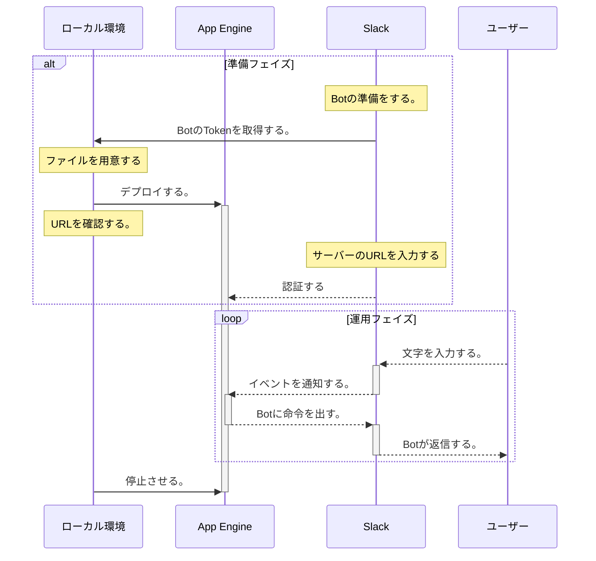

```mermaid.js
sequenceDiagram
    participant local as ローカル環境
    participant gae   as App Engine
    participant slack as Slack
    participant user  as ユーザー
    alt 準備フェイズ
        Note over slack: Botの準備をする。
        slack ->> local: BotのTokenを取得する。
        Note over local: ファイルを用意する
        local ->>+ gae: デプロイする。
        Note over local: URLを確認する。
        Note over slack: サーバーのURLを入力する
        slack -->> gae: 認証する
    end

    loop 運用フェイズ
        user -->>+ slack: 文字を入力する。
        slack -->>+ gae: イベントを通知する。
        deactivate slack
        gae -->>+ slack:Botに命令を出す。
        deactivate gae
        slack -->> user: Botが返信する。
        deactivate slack
    end
    local ->> gae:停止させる。
    deactivate gae
```